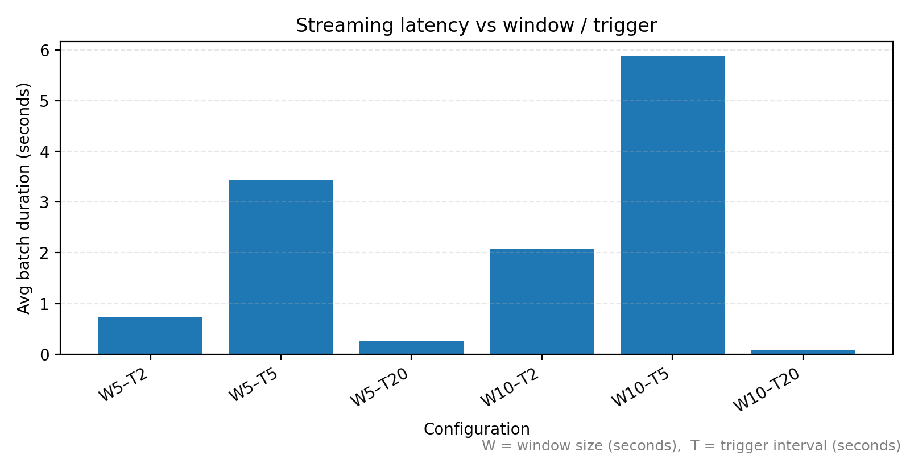
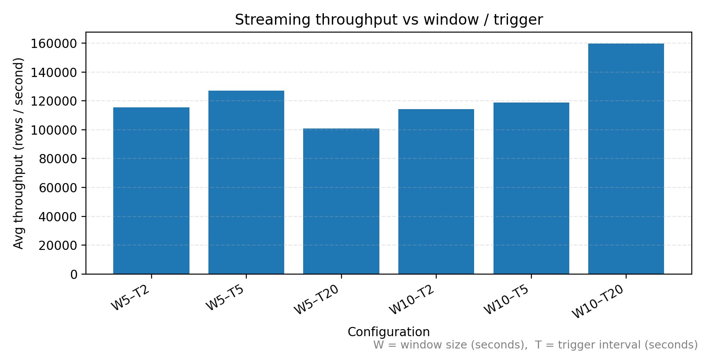

# Streaming Performance Experiments

## Overview

The goal of this phase is to understand how different Spark Structured Streaming configurations affect performance — specifically **latency** (seconds per micro-batch) and **throughput** (rows per second).

We use a custom `foreachBatch` sink in `stream_job.py` to log, for each batch:

- `timestamp`
- `batch_id`
- `rows`
- `duration_sec`
- `throughput_rows_per_sec`
- `config` (window + trigger)

All logs are stored in:

- `outputs/metrics/metrics.csv`

---

## Experimental Setup

- **Input mode:** file-based ingestion  
- **Simulator:** `src/simulate_stream.py`
  - Copies 5,000-row CSV chunks from `data/seeds/` into `data/incoming_stream/` every 20 seconds.
  - Keeps only the most recent 10 chunks in `data/incoming_stream/`.
- **Streaming job:** `python -m src.stream_job --config <config file>`
- **Base config:** `config/stream.yaml`

### Experiment configurations

We ran the streaming job with the following configurations:

| Config file                    | Window   | Trigger   |
|--------------------------------|----------|-----------|
| `config/stream.yaml`           | 5 sec    | 20 sec    |
| `config/stream_win5_trig5.yaml`| 5 sec    | 5 sec     |
| `config/stream_win5_trig2.yaml`| 5 sec    | 2 sec     |
| `config/stream_win10_trig5.yaml`| 10 sec  | 5 sec     |
| `config/stream_win10_trig2.yaml`| 10 sec  | 2 sec     |
| `config/stream_win10_trig20.yaml`| 10 sec | 20 sec    |

Each CSV chunk contains **5,000 rows**, so once the stream reaches steady state each micro-batch processes roughly 5,000 rows.

---

## How the metrics are computed

Inside `stream_job.py` we attach a `foreachBatch` sink to the canonical streaming DataFrame (`df`):

- For each micro-batch, we:
  - Call `batch_df.count()` to get `rows`.
  - Measure wall-clock time around the count to get `duration_sec`.
  - Compute `throughput_rows_per_sec = rows / duration_sec`.
  - Append a CSV line to `outputs/metrics/metrics.csv` with:
    - `timestamp, batch_id, rows, duration_sec, throughput_rows_per_sec, config`.

The `config` column is a simple label of the form:

- `file|window=5 seconds|trigger=2 seconds`
- `file|window=10 seconds|trigger=20 seconds`
- etc.

This makes it easy to group and aggregate by configuration later (for plotting or analysis).

---

## Results (steady-state behaviour)

Once the pipeline warms up, steady-state batches show consistent patterns:

- For all configurations, each batch processes about **5,000 rows**.
- The **first batch** for a given config is slower (Spark startup, state initialization, etc.).
- Later batches are much faster and more stable; these are what we use for comparison.

Qualitatively:

- **Shorter triggers (2s, 5s)**:
  - Lower per-batch latency (small `duration_sec`).
  - Higher throughput (more rows per second).
- **Longer triggers (20s)**:
  - Higher per-batch latency.
  - Lower effective throughput because Spark is idle between triggers.
- **Window size (5s vs 10s)**:
  - Much less impact on performance than trigger interval.
  - First batch for a given window can be slightly slower, but steady state is similar.

---

## Plots

We use `scripts/plot_performance.py` to:

1. Read `outputs/metrics/metrics.csv`.
2. Group by `config`.
3. Drop the first batch per config (warmup).
4. Compute average `duration_sec` and `throughput_rows_per_sec` per config.
5. Produce two bar plots:

### 1. Average latency by configuration

Saved to:

- `plots/latency_by_config.png`

Embedded here:

This shows the mean micro-batch processing time (in seconds) for each `(window, trigger)` combination, after warmup.

### 2. Average throughput by configuration

Saved to:

- `plots/throughput_by_config.png`

Embedded here:

This shows the mean throughput (rows per second) for each configuration.

---

## Key Findings

1. **Trigger interval is the dominant factor.**  
   - Configurations with **2-second** and **5-second** triggers achieve the highest throughput (on the order of tens or hundreds of thousands of rows per second) with low latency per batch.
   - Configurations with a **20-second** trigger show lower effective throughput because Spark does more waiting between micro-batches.

2. **Window size (5s vs 10s) has relatively small impact on raw performance.**  
   - Our aggregations are light (simple averages and sums), so the window size does not drastically change per-batch cost.
   - The choice of window is more about analytics granularity than performance.

3. **Warmup batches are visibly slower.**  
   - The first batch for each configuration has higher `duration_sec` because Spark is initializing the query, reading initial files, and setting up state.
   - After we ignore the first batch per config, performance stabilizes and is much more representative of steady state.

4. **The system easily handles the simulated workload.**  
   - With 5,000 rows per batch, sub-0.1 second processing times are common in steady state.
   - This leaves plenty of headroom for higher ingestion rates or more complex downstream analytics if needed.

---
